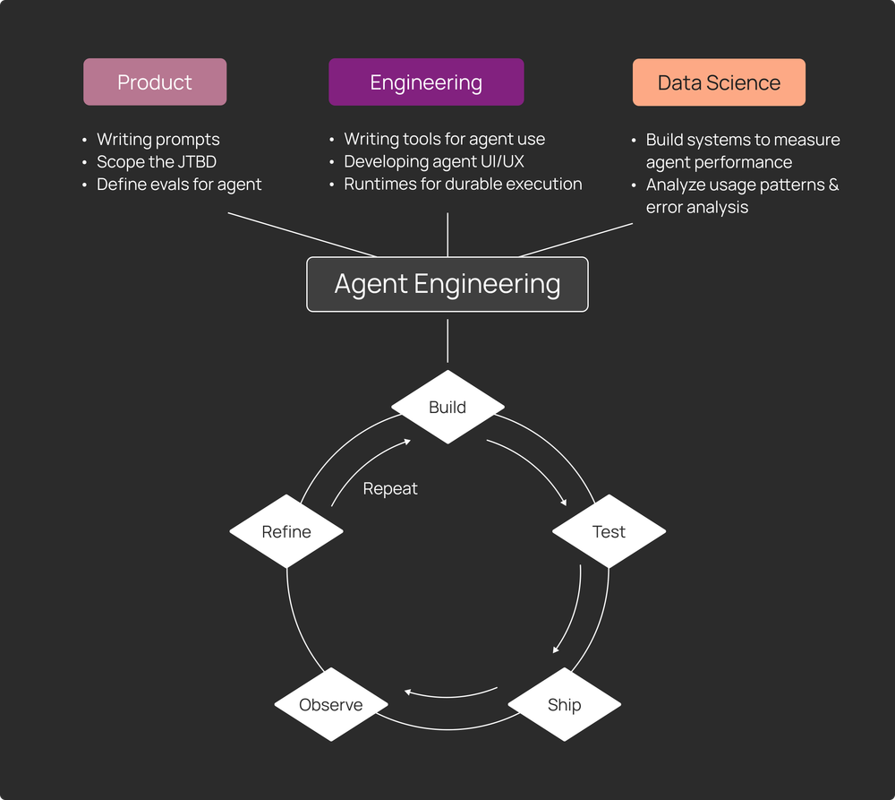

---
format:
  revealjs:
    theme: simple
    slide-number: false
    transition: fade
    background-transition: fade
    css: index.css
    disable-layout: true
    margin: 0
---

## {.team-slide}

  
Agentic AI Course

  
<em>Special Topics</em>

JB

<strong>James Beeson</strong>
Team Leader / Curriculum Design
Data Science

ES

<strong>Ethan Saline</strong>
Website / Course Developer
Brief intro or fun fact

WJ

<strong>Wil Jones</strong>
Website / Course Developer
Loves playing the tenor saxophone

IB

<strong>Ian Blad</strong>
Course Developer
I/O Psych Major

KJ

<strong>Kimberly Juarez</strong>
Course Developer
Brief intro or fun fact

CR

<strong>Camila Ramirez</strong>
Course Developer
Brief intro or fun fact

## {.deliverables-slide}

Deliverables

01

DS Society Bootcamp Curriculum with Website

02

Special Topics Curriculum with Website

03

Additional Teaching Resources - instructor notes, grading schema, etc.

## {.web-embed-slide}

<iframe src="https://wiljones-red.github.io/Agentic_Bootcamp/" title="Agentic Bootcamp" loading="lazy" referrerpolicy="strict-origin-when-cross-origin" allowfullscreen></iframe>

## {.web-embed-slide}

<iframe src="https://ethanbyui.github.io/agentic_ai_course/" title="Agentic AI Course Site" loading="lazy" referrerpolicy="strict-origin-when-cross-origin" allowfullscreen></iframe>

## {.image-fill-slide}

<!-- ## {.web-embed-slide}

<iframe src="https://blog.langchain.com/agent-engineering-a-new-discipline/" title="Agent Engineering Article" loading="lazy" referrerpolicy="strict-origin-when-cross-origin" allowfullscreen></iframe> -->

## {.objectives-slide}

::: {.objectives-block}
### Course Objectives

::: {.incremental}
- Be able to plan, program, measure, test, and iteratively refine Agentic AI solutions.
- Know which problems are best solved with Agentic AI and when it is appropriate to do so.
- Define Agentic AI and related concepts.
- Grow an ability to self-learn in an ever-changing AI landscape.
:::
:::

## {.curriculum-slide}

::: {.curriculum-header}
::: {.curriculum-title}
Course Structure
:::
::: {.curriculum-subtitle}
Units and Capstone Overview
:::
:::

::: {.curriculum-grid}
::: {.curriculum-box .fragment data-fragment-index="1"}
::: {.unit-label}
Unit 1
:::
::: {.unit-title}
Foundations - Tooling and Frameworks
:::
::: {.unit-body}
- Connect LLMs to tools and MCP
- ReAct agent framework 
- Python (LangChain)
:::
:::

::: {.curriculum-box .fragment data-fragment-index="2"}
::: {.unit-label}
Unit 2
:::
::: {.unit-title}
Diagnostics
:::
::: {.unit-body}
Use diagnostic systems (LangSmith) to: 

- Analyze traces
- Create numeric measures 
- Create test cases (Golden datasets)
- Perform A/B testing against test cases
:::
:::

::: {.curriculum-box .fragment data-fragment-index="3"}
::: {.unit-label}
Unit 3
:::
::: {.unit-title}
Context Engineering
:::
::: {.unit-body}
Refine agents using:

- Deliberate architecture planning
- Context engineering
  - Context offloading (file syste, RAG)
  - Subagent orchestration
  - Sandboxing
:::
:::

::: {.curriculum-box .capstone-box .fragment data-fragment-index="4"}
::: {.unit-label}
Capstone
:::
::: {.unit-title}
Battle of the Bots and Contribution Assignment
:::
::: {.unit-body}
- Student-made agents go head to head in a competition
- Students update or adjust the curriculum to current AI standards
:::
:::
:::
